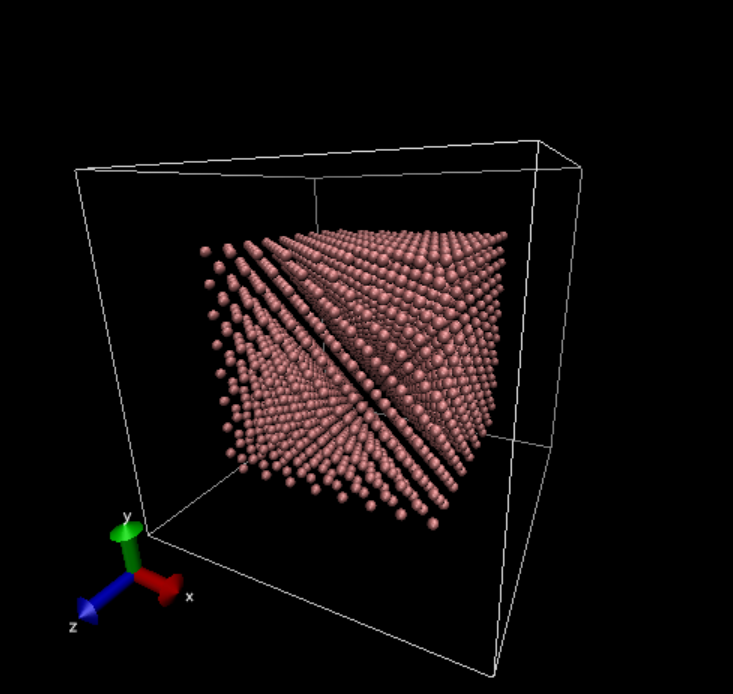
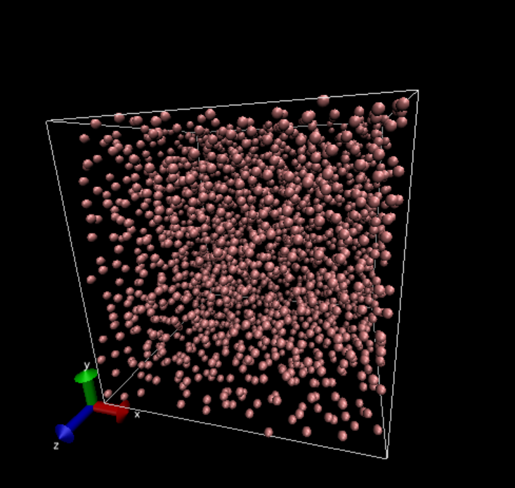
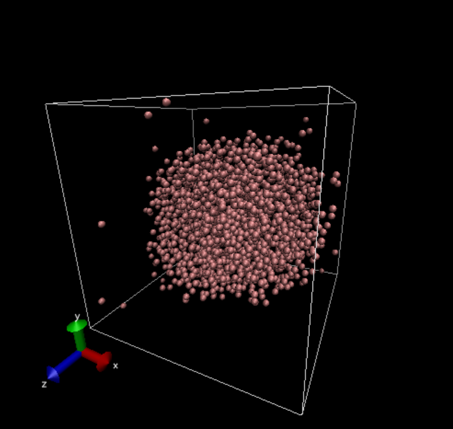

# LAMMPSのサンプルコード

Lennard-Jones (LJ)ポテンシャルと Weeks-Chandler-Andersen (WCA)ポテンシャルの比較。

## 使い方

`generate_config.py`を実行すると`config.atoms`ができるので、その後に`wca.input`や`lj.input`をLAMMPSに食わせる。

```sh
python3 generate_config.py
lmp_serial < wca.input
lmp_serial < lj.input
```

## 結果

最初は系の中央にFCC格子を組んだ状態になっている。LJ、WCAともに同じ位置、同じ初速が与えられている。



WCAの場合は引力がないので系全体に散らばる(流体状態)。



LJの場合は温度が低ければ中央に液滴を作る。また、周囲には希薄なガスを作る(気液共存状態)。



## LISENCE

This software is distributed under the MIT lisence.
